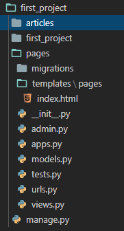

# TIL

> August 14th 2020 
>
> HaeSung Kang


## During the VSCode

>  => :grey_question: 과정중에서 헷갈린부분이나 시간이 오래걸렸던 부분

- => :book: 다시 공부가 필요한 부분

### Django


#### startapp

```bash
$ python manage.py startapp <app_name>
```

✅  app설치하고나서 settings.py가서 INSTALLED_APPS에 app_name넣어주기

```python
INSTALLED_APPS = [
    # 1. local apps
    'pages',
    # 2. 3rd party apps
    # 3. django apps
    'django.contrib.admin',
    'django.contrib.auth',
    'django.contrib.contenttypes',
    'django.contrib.sessions',
    'django.contrib.messages',
    'django.contrib.staticfiles',
]
```


#### Base-Template Directory

```python
TEMPLATES = [
    {
        'BACKEND': 'django.template.backends.django.DjangoTemplates',
        'DIRS': [BASE_DIR / '#' / 'templates'],
        },
]
```

- Base.html의 위치를 보고 Directory 설정하기


	#### project_name/urls.py

```python
from django.contrib import admin
from django.urls import path, include

urlpatterns = [
    path('admin/', admin.site.urls),
    path('articles/', include('articles.urls')),
    path('pages/', include('pages.urls')),
]
```

- articles, pages라는 app이 있을경우 경로 설정하는 방법


#### Templates directory



> templates/pages/index.html을 보면은 pages라는 앱안에서 templates를 만들어준후 그안에서 pages라는 폴더를 하나더 생성한다 그리고나서 원하는 html(example index.html)을 작성한다


#### Throw.html & Catch.html

##### throw html

```html



  <h1>Throw 페이지</h1>
  <form action="" method="GET">
    <label for="name">데이터 입력 : </label>
    <input type="text" id="name" name="name">
    <input type="submit">
  </form>

```

##### catch.html

```html



  <h1>Catch 페이지</h1>
  <h2>throw 에서 보낸 데이터는 {{ message }} 입니다.</h2>
  <a href="">back</a>

```

✅ Throw & Catch의 관계 잘생각해보면서 코드 이해하기


#### Django Tags

##### for tag

```html
  
    {{ menu }}
  
```
##### forloop.counter tag

```html
  
    {{ forloop.counter }} : {{ menu }}
  
  <hr>
```
##### empty tag

```html
  
    {{ x }}
  
    <p>아무것도 없어요!!</p>
  
```
##### if tag

```html
  <h2>if tag</h2>
  
    <p>짜장면은 고추가루지</p>
  
  <hr>
```
##### if & length tag

```html
  
    <p>10보다 큼</p>
  
    <p>10보다 작음</p>
  
```

