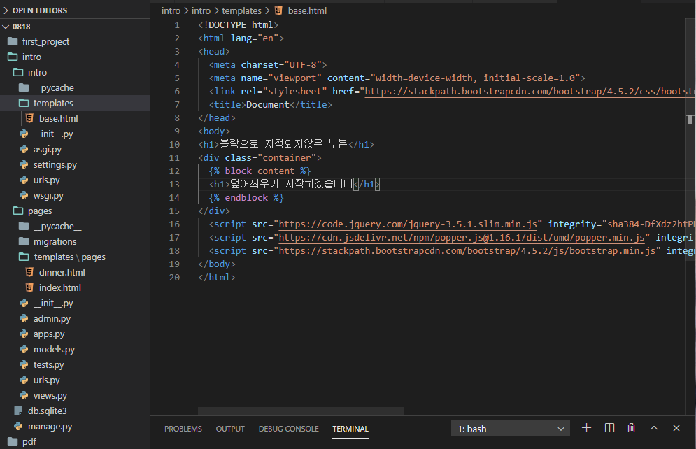
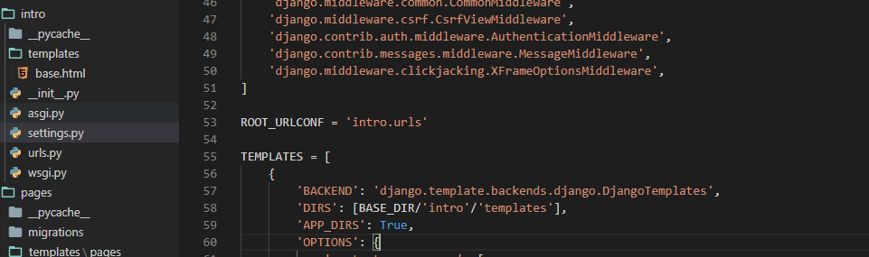
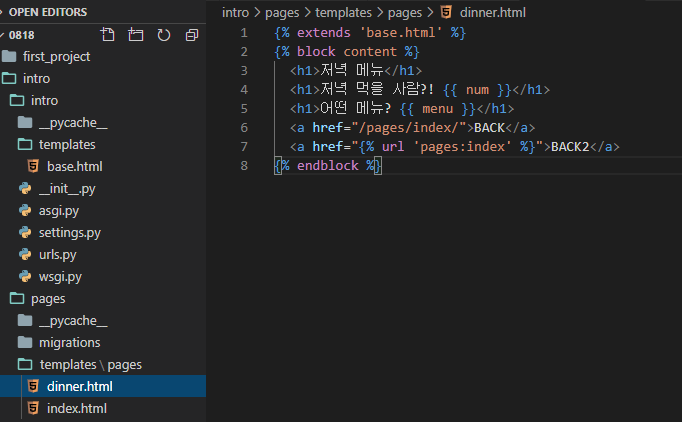
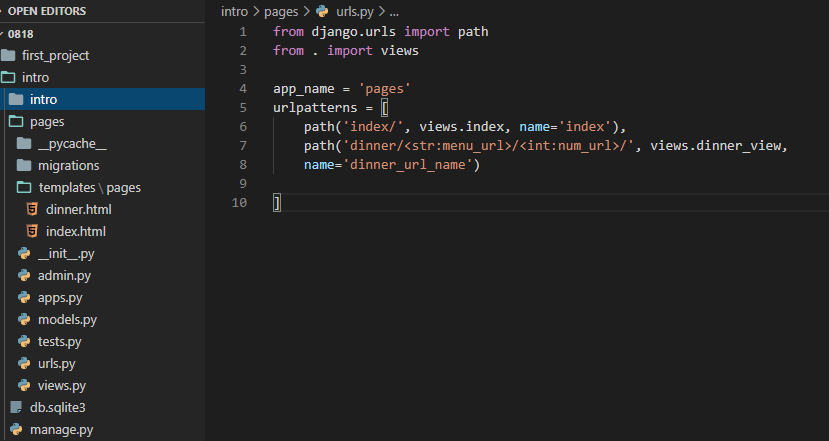

# TIL

> August 18th 2020
>
> HaeSung Kang


## During the VS Code

> 새로 배운 코드나 다른 방법으로 접근한 코드 정리


### Base Template

#### base.html



```html
<h1>블락으로 지정되지않은 부분</h1>
<div class="container">
  
  <h1>덮어씌우기 시작하겠습니다</h1>
  
```

- 처음에 template에서 base template을 지정해주기 위한 파일 경로와 해야할 작업 확인하기

#### settings.py



- Template에서 file-directory 설정해주기

#### urls.py

```html
from django.contrib import admin
from django.urls import path, include

urlpatterns = [
    path('admin/', admin.site.urls),
    path('pages/', include('pages.urls'))
]
```

- urls.py에서 import include의 의미 정확히 파악하기

#### ~~.html



```html
  <a href="/pages/index/">BACK</a>
  <a href="">BACK2</a>
```

- Link를 걸어주는 파일을 자세히보면 경로가 원래 배웠던 경로에서 추가된 부분이있다 
- Folder에서 일단 templates/pages 이런식으로 추가가되었고 url 경로 또한 pages/가 따로 설정되어있다

#### urls.py



```html
from django.urls import path
from . import views
```

- from . import views를 자세히 보면 .을 통해서 따로 설정을 안하는 이유를 알아내자
- naming을 통해서 이름을 따로 설정해주는 습관가지기 


## Need to solve

- 각각 배운것들 Blank 상태에서 다시 시작하기
- 실습과정에서 오류났던 부분들 다시 생각해보기

